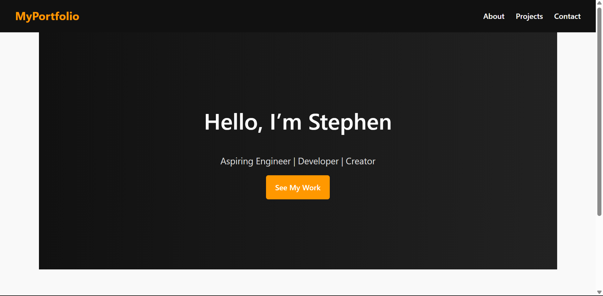

# 🌐 My Portfolio Website

A responsive **personal portfolio website** showcasing my skills, projects, and contact information.  
Built with **HTML5, CSS3, and JavaScript**, and deployed online for easy access.

---

## ✨ Features
- 📱 **Responsive design** – mobile-friendly layout  
- 🧭 **Sticky navigation bar** with hamburger menu on small screens  
- 🎨 **Modern UI styling** with hover effects & animations  
- 💻 **Projects showcase** in a responsive grid  
- 📬 **Contact form** with basic validation  
- ⚡ Clean, modular, and maintainable codebase  

---

## 📂 Project Structure
/project-root
/css
style.css # Main stylesheet
/js
script.js # Interactivity & validation
/images # Profile + project images
index.html # Home
about.html # About page
projects.html # Projects page
contact.html # Contact page
README.md # This file

---

## 📸 Screenshots
> *(Add screenshots here once the site is running)*

---

## 🚀 Deployment
This site is live here 👉 [Live Demo](https://stephen-henya.github.io/plp-webtechnologies-classroom-july2025-july-2025-final-project-and-deployment-Final-Project-and-Depl/)  

Hosted using **GitHub Pages**.  

---

## 🛠️ Tech Stack
- HTML5 – semantic structure  
- CSS3 – responsive design, styling, animations  
- JavaScript – navigation toggle & form validation  

---

## 📧 Contact
If you’d like to reach out:  
- Email: henyastephen@gmail.com  
- LinkedIn: [My LinkedIn](https://linkedin.com/in/stephen-henya)  
- GitHub: [My GitHub](https://github.com/stephen-henya)

---
